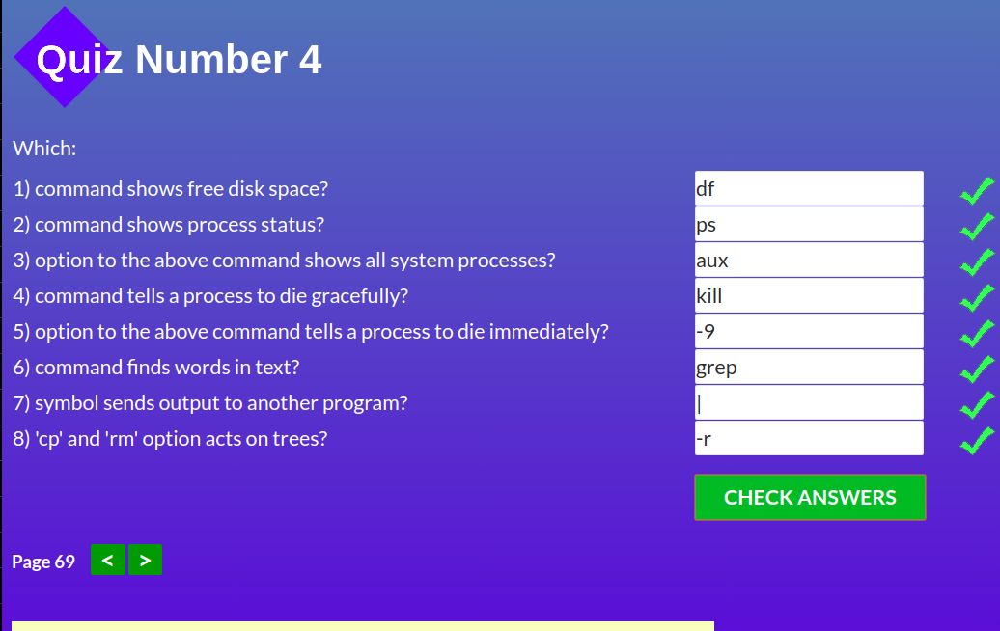
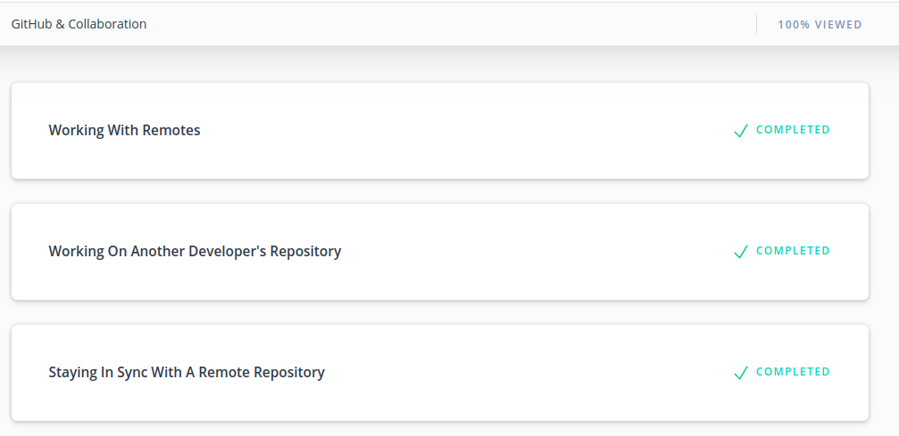

# kottans_lessons
## Lesson 1 - Git
- didn-t know about `git log --oneline`
## Lesson 2 - Unix Shell

- learned about permissions
- didn't know **man -k command**
- really did like expansion chapter :)
## Git Collaboration

- was interesting but need more practice
- learned about squashing, didn't use it previously and going to use it as it is powerful useful tool
- want to try to stay synced with my friend
